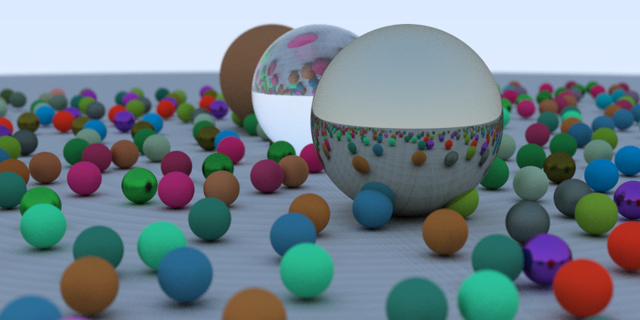

# Ray Tracing in One Weekend in Futhark

This is a port of [Ray Tracing in One
Weekend](https://github.com/RayTracing/raytracinginoneweekend) to the
purely functional data-parallel language
[Futhark](https://futhark-lang.org), which can generate efficient GPU
code.  While
[other](https://github.com/diku-dk/futhark-benchmarks/tree/master/accelerate/ray)
[ray](https://github.com/nqpz/futracer)
[tracers](https://github.com/nqpz/fastcast) have previously been
implemented in Futhark, these all focused on real-time rendering, and
supported very few visual effects (e.g. only one ray per pixel).

The scene below took about 9 seconds to render on and AMD Vega 64
GPU, and is 800x400 pixels, with 200 samples per pixel, and a maximum
of 50 reflections per ray.



## Details

Most of the design and the coding style has been maintained from the
original C++ implementation.  However, there are some substantial
differences.

* Futhark does not support recursion.  The recursive `color` function
  has been rewritten to use a `while`-loop instead, carrying along the
  "current colour" (initially all white), which is then modified
  whenever an object is hit.  This was surprisingly painless - the
  original implementation was essentially also iterative.

* Futhark is not an object-oriented language, so the various objects
  are represented as algebraic data types and records.  The scene
  graph is simply an array of objects.

* Futhark is a pure language, so a random number function like
  `drand48()` is not possible.  Instead, I use the
  [cpprandom](https://github.com/diku-dk/cpprandom) library to
  generate random numbers.  This requires threading through an RNG
  state into many functions, which can look quite noisy.  This was the
  only particularly annoying part of the port.

There are some artifacts left - for example, look at the concentric
stripes on the ground in the image above.  I'm not sure where they
come from, but I suspect either that I seed the RNGs poorly (I had
some other trouble with that), or numerical issues.

## Running

You will need Futhark 0.12.0 or newer to run this code.  Note that as
of this writing, this is an unreleased version.  You will also need
[data2png.py](https://github.com/diku-dk/futhark/blob/master/tools/data2png.py),
which turns Futhark values into PNG images.  Once these are available, run:

```
$ futhark pkg sync
$ futhark opencl raytracer.fut
$ echo 800 400 200 | ./raytracer -b | python data2png.py scene.png
```

GUI
===

If you are feeling adventuresome, you can also try an interactive
(sort of) GUI by running:

```
$ futhark pkg sync
$ make run
```

You will see a black screen.  Press a number key to fire that many
rays from each pixel.  See how the image improves!  (Slightly and
slowly.)

## See Also

* [Accelerated Ray Tracing in One Weekend in
  CUDA](https://devblogs.nvidia.com/accelerated-ray-tracing-cuda/).
  See how much low-level work Futhark saves you from!
